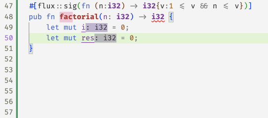
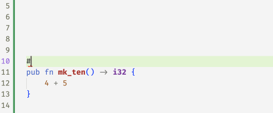
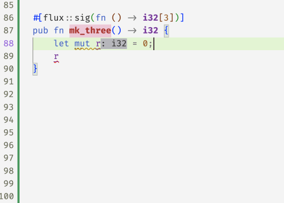

`flux` is a refinement type checker for Rust.

Here are some verification samples
You can find more in the tests/pos.

# Online Demo

You can try `flux` [online at this site](https://flux.programming.systems)

annotate with reflect. look at AST then copy that and map it into flux IR. spec_collector traverses entire codebase and looks at every attribute for every item and makes a mapping item-> atribute. check if reflect attribute is there, then try to map it into a flux spec. 
reflect structs also with refine_by

# Overview

For an overview, take a look at the [`flux` website](https://flux-rs.github.io).

# Docs

Documentation, including installation and usage guides can be found on the
[website](https://flux-rs.github.io/flux).

# Flux architecture how it works

link to docs

# Why Flux?

Type systems have been successfully used to statically catch errors, like dividing an integer with a boolean. Still, well typed programs *can* go wrong, for example, with a division by zero resulting in a run-time exception!

Liquid Types enrich existing type systems with *logical predicates* and let you specify and automatically verify *semantic* properties of your code.

**Structural vs. Semantics Properties**

Most type systems reason about the structure of program values. integers and booleans have different structure, i.e., they are usually internally represented in different ways and they can be used with a different set of operations: integers can be divided and booleans can be conjuncted.

Other than the structure, values also have semantics. Liquid Types enrich existing type systems with logical predicates and let you specify semantic properties of values. For example, the `Int` type, can be refined with logical predicates to describe integer values different than `0`. 

Since with Liquid Types we are able to talk about semantics of values, we can also statically catch semantic type errors, like division by zero.

## Steps (and links to papers about them)

1. Flux surface
2. MIR
3. Horn
4. liquid + SMT

# Flux vs other tools

Automatically infers loop invariant of loops. 

Flux does not support refining floats.

# Resources

- link to flux paper
- presentations about flux

Flux is only keeping track of the type, not exact values.

Flux surface has the syntax
this goes to flux desugar (insert fhir block comment)

what does it mean: by not having quantifiers, you can easily infer invariants

# see the installation guide in docs

# quickstart run flux

debugginng process:

dump internal data to `./log/`
FLUX_DUMP_CONSTRAINT=1 FLUX_DUMP_MIR=1 cargo flux

debug assertions
cargo xtask install --debug

All the cargo xtask commands

cargo xtask test
cargo xtask run - to run on a single file

You lose refinement info when casting between types.
