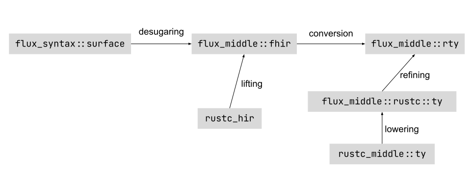

# High-level Architecture

Flux is implemented as a compiler [driver](https://rustc-dev-guide.rust-lang.org/rustc-driver.html?highlight=Callbacks%5C#rustc_driver-and-rustc_interface). We hook into the compiler by implementing the [`Callbacks`](https://doc.rust-lang.org/nightly/nightly-rustc/rustc_driver/trait.Callbacks.html) trait. The implementation is located is in the `flux-driver` crate, and it is the main entry point to Flux.

## Intermediate Representations

Flux's architecture follows the `rustc` structure. Flux breaks the compilation process down into several steps. The types go through a few intermediate representations (IR) during the refinement process. Each IR represents a refined version of an equivalent type in some `rustc` IR. We have picked a distinct *verb* to refer to the process of going between these different representations to make it easier to refer to them. The following image summarizes all the IRs and the process for going between them.



## Tracing the refinement process

Let's break down what happens at each step. The compiling and refinement processes are massively complicated, so using sequential IRs allows us to worry about one transformation in each step.

### Parsing (code -> surface)

> The surface IR represents source level Flux annotations. It corresponds to the [`rustc_ast`](https://doc.rust-lang.org/nightly/nightly-rustc/rustc_ast/index.html) data structures in `rustc`. The definition as well as the parser is located in the `flux-syntax` crate.

TODO: I combined this into the next step. Put that info in here.

### Desugaring: Surface -> FHIR

> The Flux High-Level Intermediate Representation (fhir) is a refined version of [`rustc`'s hir](https://doc.rust-lang.org/nightly/nightly-rustc/rustc_hir/index.html). The definition is located in the `flux_middle` crate inside the `fhir` module. The process of going from `surface` to `fhir` is called *desugaring*, and it is implemented in the `flux-desugar` crate.

The type refinement process starts with `flux_syntax::surface`. Flux's input is the abstract syntax tree (AST) that is generated by `rustc`'s parser. The AST is a direct representation of the source code.

surface has a few jobs in the "desugaring" process of transforming the input AST to FHIR. surface needs to get the Flux signatures, do name resolution, and desugar syntax.

#### Getting Flux signatures

Flux begins by using `collector`s to traverse the entire source code for where the user has added `#flux` annotations. Flux collects the `{tokens}` which make up the annotation (`#flux::({tokens})`) and parses it in `collect.rs` (TODO: this is the wrong file name. Is this supposed to be `flux-syntax/src/lib.rs`?). The parser, lalrpop, takes each function definition and produces a map from `functions_id` to `flux_function_signature` (TODO: these are wrong). The same process happens for every refineable syntax (structs, traits, etc). In the limit, this would include refining all Rust syntax.

#### Name resolution

Name resolution involves corresponding literal text to tags. The characters "vec" becomes associated with `Vec`. This conversion maps names to `DefID`s.

For every function, we have a Flux function signature in surface. Flux does name resolution on this AST and does some name resolution in refinements. For example, surface will match the two `v`s in `i32{ v. v > 0 }`.

Note that there is a HIR version for types and function bodies. For example, Rust will desugar while loops into for loops. For our refinement purposes, we do not care about this. We only care about resolving types. After desugaring, all path strings have been resolved in FHIR (just like in rustc HIR). Furthermore, syntax sugar has been removed (ex: `fn(x:i32)` -> `fn(i32[@x])`).

In the code, you can think of the transformation as follows:

```rs
fn desugar_ty(&mut self, ty: &surface::Ty) -> Result<fhir::Ty<'genv>>
```
```rs
fn(x:i32, y: i32) -> \forall x: int, y: int. fn(i32[x], i32[y])
```

### Conversion: FHIR -> Rty

> The definition in the `flux_middle::rty` module correspond to a refined version of the main `rustc` representation for types defined in [`rustc_middle::ty`](https://doc.rust-lang.org/nightly/nightly-rustc/rustc_middle/ty/index.html). The process of going from `fhir` to `rty` is called *conversion*, and it is implemented in the `flux_fhir_analysis::conv` module.

Once we have the FHIR, we need to do sort checking. Sorts are the type system for the logic. For example, an `i32` is indexed by an `int`. An `i32` is *not* an `int`; rather it is indexed by an `int`. The Z3 solver cannot reason about vectors, so you abstract over the internals and idealize the value as a particular sort in the logic. Thus, in practice sorts are anything that Z3 supports. Sorts seem similar to types, but the two get more separated as you go down the stack. Sorts are built to refine base types (`BaseTy`).
(Aside: this gets more complicated with the `refined_by` annotation. In this case, Flux creates a custom sort for each field that refines the struct.)

Suppose Flux is refining the following scenario:
```rs
fn (x: bool{ x + 1 == 0})

-> desugaring step gives you ->

fn(x:_, y: _ [need to infer this is a int]) -> \forall x: int, y: int. fn(i32[x] | y + 1 == 0, i32[y])
```

 For technical reasons, we do not know that `x` and `y` are `int`s during desugaring. In this step, we need to infer that they actually are `int`s. Next, `sortck.rs` is going to check that all the sorts are well formed. For example, it will check `y` is not a `bool` in `y + 1`.

TODO: I'm writing nonsense beyond this point

```rs

               desugar                                     conversion
fn(x:i32, y: i32) -> \forall x: int, y: int. fn(i32[x], i32[y]) -> rty ty
// rty ("refined type")
// ty : rustc also has a Ty which is the internal representation. 
```
### Simplified Rustc

> The definition in the `flux_middle::rustc` module correspond to simplified version of data structures in `rustc`. They can be understood as the currently supported subset of Rust. The process of going from a definition in `rustc_middle` into `flux_middle::rustc` is called *lowering* and it is implemented in `flux_middle::rustc::lowering`.

### Lifting and Refining

> Besides the different translation between Flux intermediate representations, there are two ways to get a refined version from a rust type. The process of going from a type in `hir` into a type in `fhir` is called *lifting*, and it is implemented in `flux_middle::fhir::lift`. The process for going from a type in `flux_middle::rustc::ty` into a `flux_middle::rty` is called *refining*, and it is implemented `flux_middle::rty::refining`.

```rs
fn foo <T: trait>(x: T::Assoc) // the compiler has to do some work in LOWERING convversion to map the explicit syntax
-> fn foo <T: trait>(x: <T as Trait>::Assoc) 
```

TODO: the verbs lifting and lowering do not make sense to me. I think these are just dummy stubs so you can interact/interpret hir and ty. Idk how these fit into explaining the process of flux.

## Repository Structure

Flux is split into many crates with different purposes.

- `book`: Contains documentation.
- `crates/flux-bin`: Contains the `cargo-flux` and `rustc-flux` binaries used to launch the `flux-driver`.
- `crates/flux-common`: Common utility definitions used across all crates.
- `crates/flux-config`: Crate containing logic associated with global configuration flags that change the behavior of Flux, e.g, to enable or disable overflow checking.
- `crates/flux-desugar`: Implementation of name resolution and desugaring from Flux surface syntax into Flux high-level intermediate representation (`fhir`). This includes name resolution.
- `crates/flux-driver`: Main entry point to Flux. It contains the `flux-driver` binary and the implementation of the [`Callbacks`](https://doc.rust-lang.org/nightly/nightly-rustc/rustc_driver/trait.Callbacks.html) trait.
- `crates/flux-errors`: Utility definitions for user facing error reporting.
- `crates/flux-fhir-analysis`: Implements the "analyses" performed in the `fhir`, most notably well-formedness checking and conversion from `fhir` into `rty`.
- `crates/flux-fixpoint`: Code to interact with the Liquid Fixpoint binary.
- `crates/flux-macros`: Procedural macros used internally to implement Flux.
- `crates/flux-metadata`: Logic for saving Flux crate metadata that can be used to import refined signatures from external crates.
- `crates/flux-middle`: This crate contains common type definitions that are used by the rest of Flux like the `rty` and `fhir` intermediate representations. Akin to [`rustc_middle`](https://doc.rust-lang.org/nightly/nightly-rustc/rustc_middle/index.html).
- `crates/flux-refineck`: Implementation of refinement type checking.
- `crates/flux-syntax`: Definition of the surface syntax AST and parser.
- `tests`: Flux regression tests.
- `lib/flux-attrs`: Implementation of user facing procedural macros for annotating programs with Flux specs.
- `lib/flux-rs`: This is just a re-export of the macros implemented in `flux-attrs`. The intention is to eventually put Flux "standard library" here, i.e., a set of definitions that are useful when working with Flux.
- `xtask`: Command line tools for scripting tasks.
